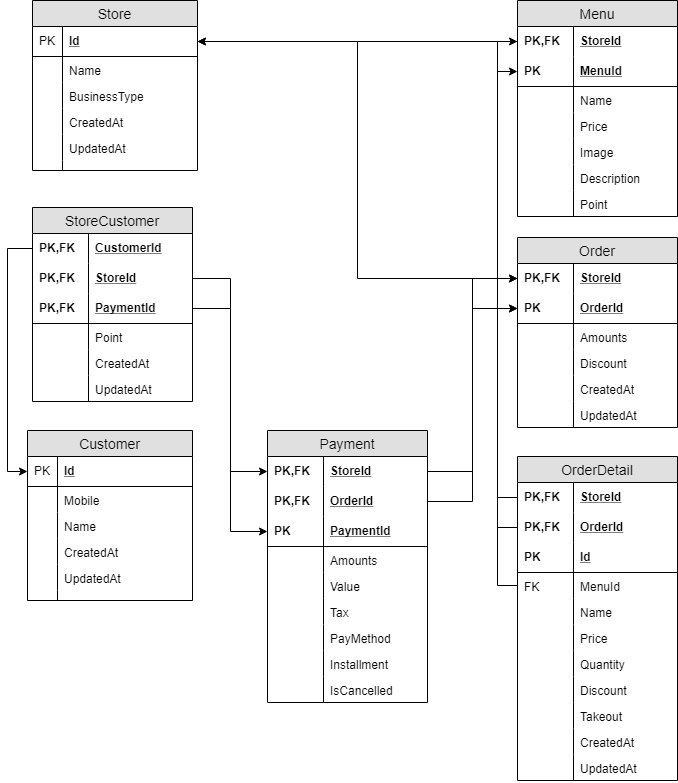
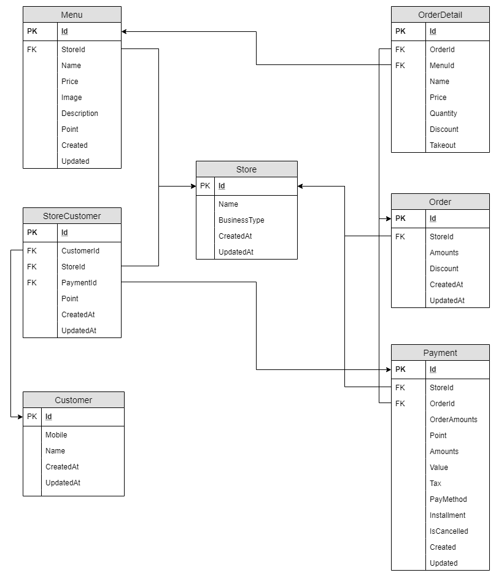

# POS <small>Point Of Sales</small> 시스템

## 요구사항

단순 메뉴를 판매하는 소매점에서 사용하는 판매시점정보관리 시스템

	• 매장관리
	• 메뉴관리
	• 주문관리
	• 고객관리
	• 결재관리 - 이번 구현에서 제외

## 기능

### 매장관리

### 메뉴관리

### 주문관리

주문은 메뉴 목록에서 항목을 추가해서 작성됩니다.

### 고객관리

고객의 전화번호를 입력받아 포인트를 적립할 수 있게 합니다.

발생된 포인트는 다음 구매에 사용할 수 있도록 합니다.

> 전화번호 입력 => 카카오에서 제공하는 기능 연계
> 이번 구현에서 제외

## 설계

엔티티간 관계를 생각해보면 아래와 같은 설계가 가능합니다.

구현의 편의를 위해 타협해서 아래와 같은 설계로 진행합니다.

